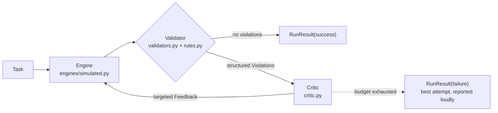

# self-correcting-agents

**A small Python framework that catches an agent's bad output with executable checks and feeds it a specific fix — instead of just retrying and hoping.**

[](https://github.com/sugeerth/self-correcting-agents/actions/workflows/ci.yml)


**[Watch the loop repair itself](https://sugeerth.github.io/self-correcting-agents/demo.html)** — a step-through replay of real recorded runs, covering all 46 corpus tasks across the three domains.
**[Write-up](https://sugeerth.github.io/self-correcting-agents/)** ([markdown source](docs/index.md))

> When an LLM step fails in a pipeline, it rarely crashes. It returns a plausible-looking wrong answer: right JSON shape, right field names, and a total that is actually the pre-discount amount. Nothing throws, and you find out weeks later from a reconciliation report. The reflex fix is "add retries" — but a naive retry re-rolls the dice with no new information, so the agent that produced the wrong total produces it again. This repo implements the alternative and measures the mechanics of it.

---

## Quickstart

The loop itself runs fully offline: no API keys, no network calls, no model download. The
default engine is a seeded fault-injection simulation. (`pip install` does reach PyPI once,
to fetch the `hatchling` build backend — there are zero *runtime* dependencies.)

```bash
git clone https://github.com/sugeerth/self-correcting-agents
cd self-correcting-agents
python3 -m venv .venv && source .venv/bin/activate
python3 -m pip install -e .
python3 -m selfcorrect demo --domain sqlq
```

Verbatim output of that last command — attempt 1 fails a check, the critic says *what* is
wrong, attempt 2 passes:

```text
━━━━━━━━━━━━━━━━━━━━━━━━━━━━━━━━━━━━━━━━━━━━━━━━━━━━━━━━━━━━━━━━━━━━━━━━
Task: sql_003
────────────────────────────────────────────────────────────────────────
Attempt 1/2 — engine: simulated — 1.01s
  output:
    task_id: sql_003
    sql: SELECT name FROM products WHERE category = 'electronics' AND price > 100 ORDER BY price …
  CODE            │ FIELD │ EXPECTED -> ACTUAL
  ────────────────┼───────┼───────────────────
  WRONG_ROW_COUNT │ sql   │ 2 -> 1
  Feedback to agent:
    • The query runs but returns 1 rows where 2 are expected. Re-read the question's filters — a
      WHERE condition is probably missing, wrong, or an unrequested LIMIT is cutting rows off.
────────────────────────────────────────────────────────────────────────
Attempt 2/2 — engine: simulated — 1.05s
  output:
    task_id: sql_003
    sql: SELECT name FROM products WHERE category = 'electronics' AND price > 100 ORDER BY price …
  violations: none
────────────────────────────────────────────────────────────────────────
VALID after 2 attempt(s)
━━━━━━━━━━━━━━━━━━━━━━━━━━━━━━━━━━━━━━━━━━━━━━━━━━━━━━━━━━━━━━━━━━━━━━━━
```

The two `sql:` lines look identical because the trace printer caps every line at 100
characters. The difference is past the cut: attempt 1 ends `… ORDER BY price DESC LIMIT 1`
(an injected stray `LIMIT`), attempt 2 ends `… ORDER BY price DESC`. Attempt latencies are simulated and
seed-derived, so this output is byte-stable across runs.

More entry points:

```bash
python3 -m selfcorrect demo --task inv_021              # a task that FAILS loudly after 3 attempts
python3 -m selfcorrect list-corpus --domain cua         # what's in a corpus
python3 -m selfcorrect bench --domain sqlq --ablation --out /tmp/bench_sqlq
python3 examples/run_demo.py                            # the inv_021 run, via the library API
python3 -m pip install pytest && python3 -m pytest -q   # 107 tests, no network
```

`pytest` is a dev dependency, not a runtime one, so `pip install -e .` does not pull it in
(there is no `[dev]` extra — CI uses `uv sync --dev`; the `pip install pytest` above is the
plain-pip equivalent).

`--domain` accepts `invoices` (default), `sqlq`, `cua`. `--engine` accepts `simulated`
(default), `hermes` (local Ollama), `anthropic` (optional extra).

---

## How it works



Four pieces, composed by `SelfCorrectingAgent` in
[`src/selfcorrect/loop.py`](src/selfcorrect/loop.py):

| Piece | Where | Job |
|---|---|---|
| `Engine` | [`engines/`](src/selfcorrect/engines/) | Produce a candidate from the task + prior feedback |
| `Validator` | [`validators.py`](src/selfcorrect/validators.py), `<domain>/rules.py` | Deterministic checks → structured `Violation`s |
| `Critic` | [`critic.py`](src/selfcorrect/critic.py) | Violations → targeted natural-language repair instructions |
| loop | [`loop.py`](src/selfcorrect/loop.py) | Bounded retry + a full per-attempt trace |

The architectural invariant is enforced in `loop.py`: **the engine never sees a raw
`Violation`.** The only call into the engine is
`self.engine.generate(task, feedback_history)` — validators speak in structured violations,
the critic translates them into instructions, and only the translation reaches the
generator.

The core (`types`, `loop`, `validators`, `critic`, `engines/simulated`) is domain-agnostic.
Each domain is a plug-in behind the registry in [`domains.py`](src/selfcorrect/domains.py):
`invoices/` (schema + `Decimal` money math), `sqlq/` (executes the candidate SQL against an
in-memory stdlib `sqlite3` fixture and checks columns, row count, and a result checksum),
`cua/` (executes a proposed action sequence against a simulated booking UI). The core's
import cleanliness — no `anthropic`, no `pydantic`, no domain package pulled in by
`import selfcorrect` — is enforced by fresh-subprocess `sys.modules` assertions in
`tests/test_optional_anthropic.py`.

---

## Results

Simulated engine, seed 42, max 3 attempts.

| Domain | Corpus | OFF | ON (targeted critic) | Ablation: generic critic | Source |
|---|---:|---:|---:|---:|---|
| Invoice extraction | 24 | 58.3% | **95.8%** | 58.3% | `bench_out/results.md` ¹ |
| Text-to-SQL | 12 | 25.0% | **91.7%** | 25.0% | [`bench_out_sqlq/results.md`](bench_out_sqlq/results.md) |
| Computer use | 10 | 50.0% | **90.0%** | 50.0% | [`bench_out_cua/results.md`](bench_out_cua/results.md) |

¹ `bench_out/` is gitignored, so the invoice row has no committed artifact to diff against;
regenerate it with `python3 -m selfcorrect bench --ablation --out bench_out`.

The two committed tables are byte-reproducible — regenerate and diff:

```bash
python3 -m selfcorrect bench --domain sqlq --ablation --out /tmp/bench_sqlq
diff /tmp/bench_sqlq/results.md bench_out_sqlq/results.md   # no output
```

(`results.json` differs in one field, `out_dir`, which records the path you passed.)

### What the ablation does and does not show

Swapping `TemplateCritic` for `GenericCritic` changes exactly one thing: the feedback the
engine receives. Read the result carefully, because the headline is weaker than it looks:

**The generic arm scoring exactly the OFF rate is true by construction, not an empirical
discovery.** `GenericCritic` emits a single `Feedback` with `violation_code="GENERIC"`, and
the simulated engine clears an injected error only when some feedback item carries a code
listed in that error's `fixed_by` set — `GENERIC` is in none of them
(`src/selfcorrect/engines/simulated.py`, `_surviving`). The fault injector encodes the
assumption "feedback repairs an error only if it names the error." That assumption is the
thesis of the repo; the benchmark does not test it.

What the benchmark *does* establish:

- The wiring is honest end to end — violations reach the critic, rendered instructions (not
  raw violations) reach the engine, and OFF / ON / generic differ in nothing else.
- The **cost** of untargeted retrying is measured, not assumed. On text-to-SQL the generic
  arm burns 2.50 mean attempts against ON's 1.92, and 23.2s of simulated latency against
  17.9s — full budget spent, zero tasks recovered.
- The ON arm's lift survives per-field scoring, not just the all-or-nothing valid rate: on
  text-to-SQL, macro field accuracy goes 66.7% → 97.2%.

Attempts to converge on text-to-SQL (from
[`bench_out_sqlq/results.md`](bench_out_sqlq/results.md); a chart version is at
[`bench_out_sqlq/attempts.svg`](bench_out_sqlq/attempts.svg)):

| configuration | 1 | 2 | 3 | failed |
|---|---:|---:|---:|---:|
| off | 3 | 0 | 0 | 9 |
| on | 3 | 7 | 1 | 1 |
| on_generic | 3 | 0 | 0 | 9 |

---

## Repo map

```
src/selfcorrect/loop.py        the bounded generate → validate → critique → repair loop
src/selfcorrect/critic.py      TemplateCritic (targeted) + GenericCritic (ablation control)
src/selfcorrect/validators.py  domain-agnostic validator building blocks
src/selfcorrect/domains.py     plug-in registry: invoices | sqlq | cua
src/selfcorrect/engines/       simulated (default) | hermes (Ollama) | anthropic (extra)
src/selfcorrect/bench.py       OFF vs ON vs ablation → results.json / results.md / SVG / traces.jsonl
skills/self-correct/           the loop's protocol as an installable Claude Code skill
tests/                         107 tests: validators, critic, loop, per-domain, bench e2e
                               (lift bounds), determinism, import cleanliness
docs/                          the write-up plus the recorded-trace demo page (GitHub Pages)
```

---

## Limitations / what this is not

- **The benchmark numbers are not model evaluations.** The default engine is a
  deterministic fault injector that makes realistic, feedback-addressable mistakes. It
  measures the *mechanics* of self-correction — not any LLM's accuracy. Every generated
  `results.md` says so on its third line.
- **The ablation is a design check, not evidence.** See above: the generic critic's floor
  falls out of the simulator's repair model. Running the same benchmark against a real
  engine (`--engine hermes` or `--engine anthropic`) is what would turn it into evidence,
  and that has not been done here.
- **It only works where correctness is executable.** The whole approach rests on a
  validator that can mechanically decide "wrong." For open-ended generation with no
  checkable contract, there is nothing to feed back.
- **Corpora are small and synthetic** — 24 invoices, 12 queries, 10 booking flows. Enough
  to show the OFF/ON/ablation gap reproducibly; not enough to claim a general effect size.
- **The live demo is a replay, not a simulation.** It steps through recorded Python runs;
  it does not re-run the loop in your browser.
- **This is not an agent framework.** No planning, no tool use, no multi-agent
  orchestration, no memory. One loop, done carefully, with the trace kept.

---

## License

MIT — see [LICENSE](LICENSE).
