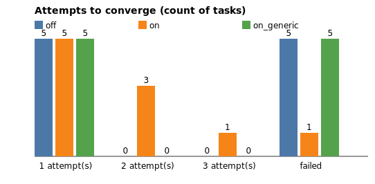

# Self-correction benchmark — computer use

**All numbers below come from the `simulated` engine — a deterministic fault-injection simulation, not a live LLM.**

Corpus: 10 flows · seed 42 · max attempts 3

## Summary

| configuration | fully valid | mean attempts | total latency (s) | total cost ($) |
|---|---:|---:|---:|---:|
| off | 50.0% | 1.00 | 8.2 | 0.0000 |
| on | 90.0% | 1.70 | 13.7 | 0.0000 |
| on_generic | 50.0% | 2.00 | 16.2 | 0.0000 |

## Field accuracy vs ground truth

| field | off | on | on_generic |
|---|---:|---:|---:|
| completed | 60.0% | 90.0% | 60.0% |
| route | 80.0% | 90.0% | 80.0% |
| flight | 90.0% | 90.0% | 90.0% |
| traveler | 60.0% | 90.0% | 60.0% |
| macro_avg | 72.5% | 90.0% | 72.5% |

## Attempts to converge

| configuration | 1 | 2 | 3 | failed |
|---|---:|---:|---:|---:|
| off | 5 | 0 | 0 | 5 |
| on | 5 | 3 | 1 | 1 |
| on_generic | 5 | 0 | 0 | 5 |

