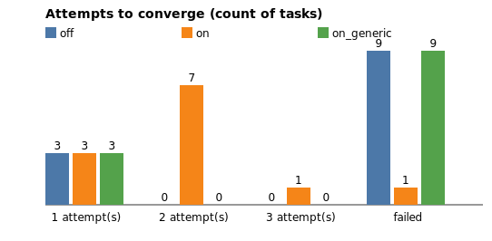

# Self-correction benchmark — text-to-SQL

**All numbers below come from the `simulated` engine — a deterministic fault-injection simulation, not a live LLM.**

Corpus: 12 queries · seed 42 · max attempts 3

## Summary

| configuration | fully valid | mean attempts | total latency (s) | total cost ($) |
|---|---:|---:|---:|---:|
| off | 25.0% | 1.00 | 10.1 | 0.0000 |
| on | 91.7% | 1.92 | 17.9 | 0.0000 |
| on_generic | 25.0% | 2.50 | 23.2 | 0.0000 |

## Field accuracy vs ground truth

| field | off | on | on_generic |
|---|---:|---:|---:|
| executes | 91.7% | 100.0% | 91.7% |
| result_columns | 66.7% | 100.0% | 66.7% |
| result_rows | 41.7% | 91.7% | 41.7% |
| macro_avg | 66.7% | 97.2% | 66.7% |

## Attempts to converge

| configuration | 1 | 2 | 3 | failed |
|---|---:|---:|---:|---:|
| off | 3 | 0 | 0 | 9 |
| on | 3 | 7 | 1 | 1 |
| on_generic | 3 | 0 | 0 | 9 |

